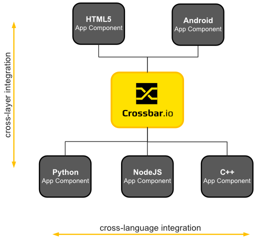

# Crossbar.io

**Crossbar.io** - Unified application router.

**Join the [mailing list](http://groups.google.com/group/autobahnws), follow us on [Twitter](https://twitter.com/crossbario) and [Quick Start](https://github.com/crossbario/crossbar/wiki/Quick-Start) with Crossbar.io!**

___________

*This README:*

1. [What is Crossbar.io?](#what-is-crossbario)
2. [Benefits](#benefits)
3. [Things you can do](#things-you-can-do)

*Related articles:*

* [Is Crossbar.io the Future of Python Web Apps?](http://tavendo.com/blog/post/is-crossbar-the-future-of-python-web-apps/) - *A developer's blog post - good introduction!*
* [Why WAMP](http://wamp.ws/why/) - *Unified Routing and WAMP explained*

*More Resources:*

* [Homepage](http://crossbar.io)
* **[Quick Start](https://github.com/crossbario/crossbar/wiki/Quick-Start)**
* [Documentation](https://github.com/crossbario/crossbar/wiki)
* [Ask a Question](http://stackoverflow.com/questions/ask?tags=crossbar,wamp)

## What is Crossbar.io?

Crossbar.io is an [open-source](https://github.com/crossbario/crossbar/blob/master/crossbar/LICENSE) server software that allows developers to create distributed systems, composed of application components which are loosely coupled, communicate in (soft) real-time and can be implemented in different languages:

Crossbar.io features **cross-language integration**: you can have application components implemented in different languages and run under different run-times. E.g. a frontend component might be implemented in JavaScript/HTML5 and run in the browser, while a backend component might be implemented in Python and run under PyPy.

Crossbar.io also features **cross-layer integration**: application components can be freely deployed across layers, and transparently talk to each other no matter in what layer the components reside. E.g. you can call a remote procedure residing in a backend component from a frontend component running in the browser, but you can also call into code running inside the browser from a backend component!

Read more::

 * [Free Your Code - Backends in the Browser](http://tavendo.com/blog/post/free-your-code-backends-in-the-browser/)

### Unified Routing

At its core, Crossbar.io provides a flexible and scalable communication infrastructure for application components to talk to each other. This communication infrastructure is based on **Unified Routing** and **WAMP**:

[Unified Routing](http://wamp.ws/why/#unified_routing) provides applications components with two communication patterns to use: **remote procedure calls** and **publish & subscribe**. In both patterns, the application components involved are fully decoupled by Crossbar.io which dynamically routes calls and events between them. [WAMP](http://wamp.ws) is an open, standardized protocol for Unified Routing that runs natively on WebSocket.

Read more:

 * [Why WAMP?](http://wamp.ws/why/)

### Component Hosting

Crossbar.io also is a **component host** able to dynamically load, run and monitor **application components** written in different languages, and running under their native run-time.

Want to have component **A** written in JavaScript and running on NodeJS, component **B** written in Python and running on PyPy, and component **C** written and running on C++ natively? No problem - Crossbar.io has you covered.

>To get you started quickly, the command line tool of Crossbar.io is able to generate complete, ready-to-run application templates for different languages.

### Multi-process Architecture

Crossbar.io has a **multi-process architecture** where a single node controller process spawns and monitors multiple worker processes. Worker process types include router, application component host and arbitrary guest processes. *The multi-process architecture enables scaling up on multi-core systems and supports secure and robust operation.*

Read more:

* [Crossbar.io Architecture](https://github.com/crossbario/crossbar/wiki/Architecture).

### Full-stack Services

Crossbar.io also includes a whole set of **full-stack services**, such as authentication and authorization, serving static Web files, HTTP long-poll fallback, HTTP push bridge, CGI scripts and hosting WSGI applications. This will often make Crossbar.io all the infrastructure you need besides your database.

## Benefits

We think that application developers and system operators should be freed from the burden and compexity of old architectures.

Crossbar.io is made for *DevOps*: it allows *developers* to easily **compose** a system from self-contained, independent services or application components and *operators* to **distribute** application components freely across system resources like nodes without breaking application communication.

We believe the above approach is scalable in terms of development and deployment, and in particular allows you to create and operate more advanced systems with less complexity and in less time.

## Things you can do

Here are a couple of demos and applications built with Crossbar.io

* [Next-gen Web](https://demo.crossbar.io/)
* [Internet-of-Things](http://tavendo.com/blog/post/arduino-yun-with-autobahn/)
* Connected Car
* [Real-time Collaboration](http://showroomdummy.com/)
* [Database-driven business applications](http://www.record-evolution.com/)
* [Messaging and chat](https://demo.crossbar.io/clandeck/)
* Multi-player online games

which can give you a hands-on impression of what you can do.

We can also take an example:

*Imagine you create a "Vote Game" web applications, where visitors can vote for one of three kinds of ice cream and the total number of votes for the different ice creams is displayed.*

Now, here is the catch: we want ot have the numbers shown to be correct - always, and instantly. Whenever someone votes on a ice cream, the displayed numbers of all visitors should update immediately.

In other words: we want a real-time enabled user interface.

From a developer point of view, what seems natural is having the frontend issue a remote procedure call to get the total number of votes initially. Then subscribe to a topic to get updates on the total number of votes. And finally issue a remote procedure call for actually voting. The backend should note each vote, and publish updated numbers for total votes. These patterns, remote procedure calls and publish & subscribe are exactly those provided by WAMP.

To summarize, above "Vote Game" app would be a good fit for Crossbar.io and is [easy to implement](https://github.com/tavendo/AutobahnPython/tree/master/examples/twisted/wamp/wamplet/votegame). 

----------

Copyright (c) 2014 [Tavendo GmbH](http://www.tavendo.com). Licensed under the [Creative Commons CC-BY-SA license](http://creativecommons.org/licenses/by-sa/3.0/). "WAMP", "Crossbar.io" and "Tavendo" are trademarks of Tavendo GmbH.
