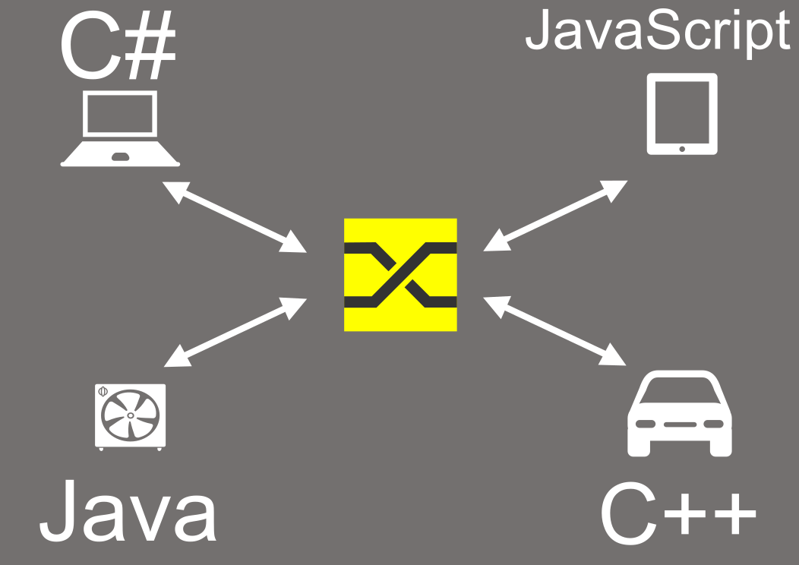
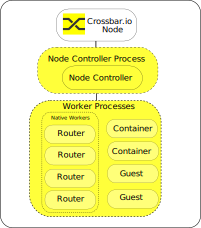
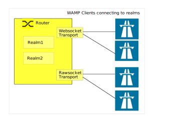
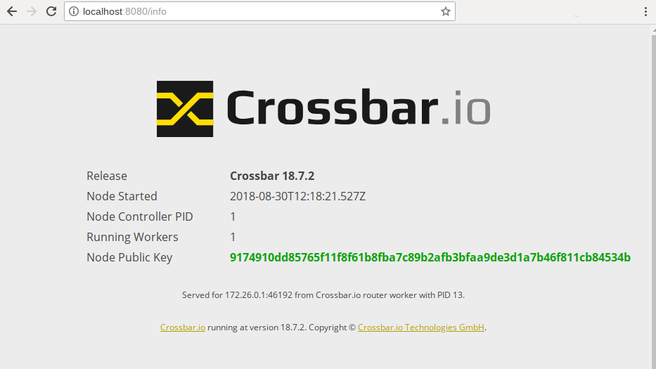
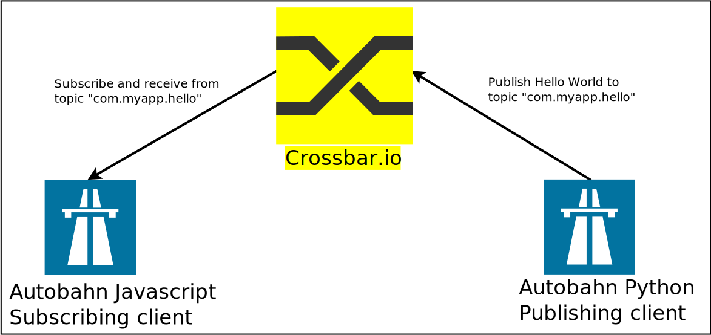
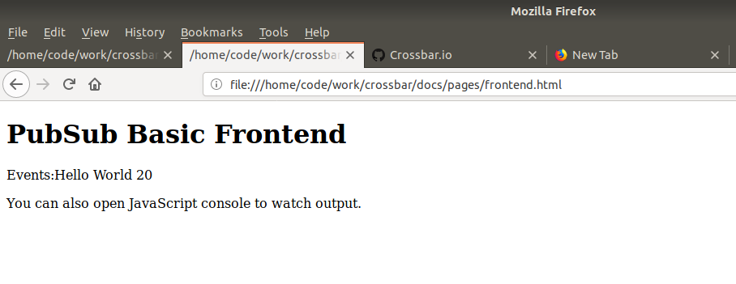
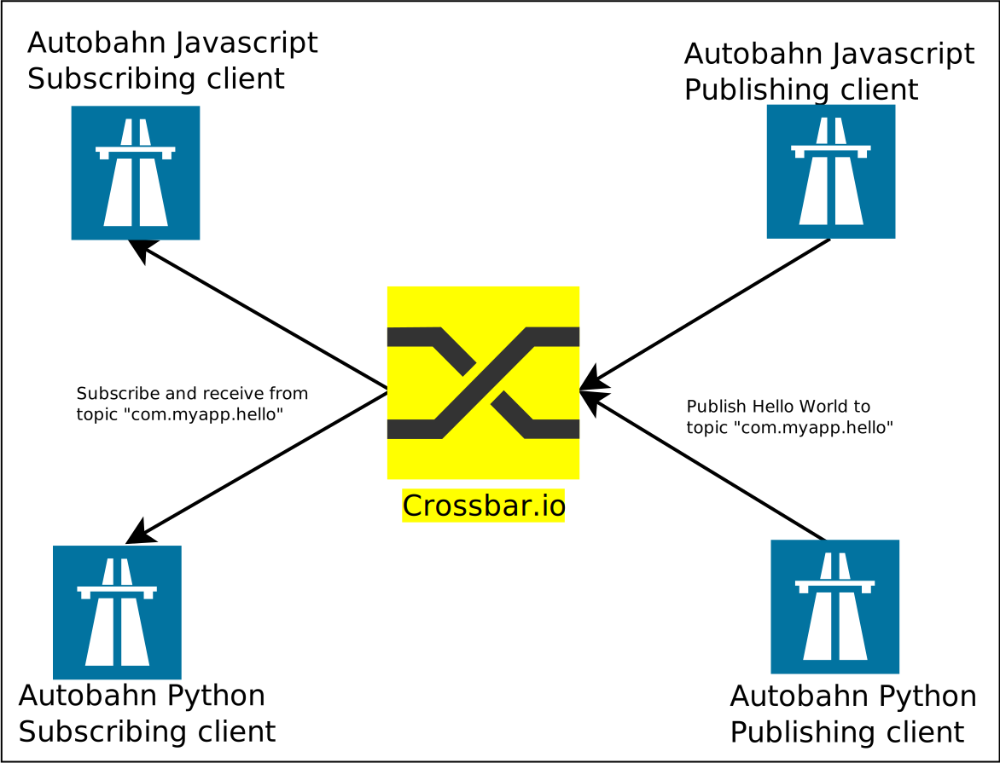
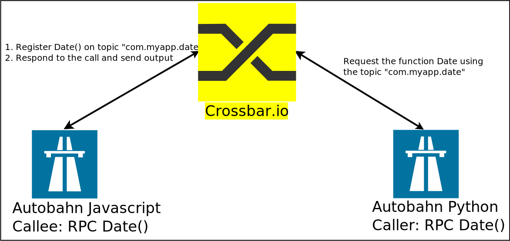

:orphan:

.. To generate html using sphnix-build
   virtualenv -p python3 testenvpy
   source testenvpy/bin/activate
   pip install sphinxcontrib-contentui
   pip install crossbar
   make html

.. _getting-started:

Getting started with Crossbar.io
################################

**Crossbar.io** is an open source networking platform for distributed and microservice applications. It is a feature rich, scalable, robust and secure
implementation of  the open `Web Application Messaging Protocol (WAMP) <https://wamp-proto.org/>`_.

What is WAMP?
=============
WAMP is a routed protocol, with all components connecting to a **WAMP Router**, where the WAMP Router performs message routing between the **WAMP client**.  WAMP provides two messaging patterns:

  * Publish & Subscribe
  * Routed Remote Procedure Calls

WAMP is a `WebSocket <https://en.wikipedia.org/wiki/WebSocket>`_ sub-protocol, which means that you can communicate with browser using it. In addition to that it can also run over any transport which is **message-oriented, ordered, reliable, and bi-directional** such as TCP, Unix domain socket, etc.

Introduction
============
Crossbar.io is a WAMP router with advanced features implemented in the Python language. It is agnostic to the implementation of the client or its deployment. The below overview shows WAMP clients in different languages communicating with each other.

WAMP Clients
============

The team behind Crossbar.io also maintains a set of WAMP clients as part of the  `Autobahn project <https://crossbar.io/autobahn/>`_.

* `Autobahn|Python <https://github.com/crossbario/autobahn-python/>`_
* `Autobahn|JS <https://github.com/crossbario/autobahn-js/>`_
* `Autobahn|Cpp <https://github.com/crossbario/autobahn-cpp/>`_
* `Autobahn|Java <https://github.com/crossbario/autobahn-java/>`_

Apart from that there are also numerous third-party implementations of `WAMP clients in different languages <https://wamp-proto.org/implementations.html/>`_.

.. note:: A qualified WAMP client with basic profile should be able to do the following things

 * **Subscribe** to a topic (eg: com.myapp.hello)

 * **Publish** to a topic

 * **Register** a procedure (eg: com.myapp.date)

 * **Call** a procedure

Prerequisite
============
For following this guide some (very) basic knowledge of **Python, Javascript, Linux and Docker** commands is useful.

What's in this guide
====================
This guide will show you how to start the Crossbar.io router and some basic application components using Docker containers. We will cover communication between both Python and JavaScript components to show you the basics of how Crossbar.io is used.
Although **Docker is not necessary to run Crossbar.io**, or to develop WAMP applications, it is the quickest way to get the necessary components for developing WAMP applications using Crossbar.io up and running.

Basic Concept:
==============
The Crossbar.io is a multi process architecture. A single instance of Crossbar.io is called Crossbar.io node. 
When a Crossbar.io node starts, initially it starts a single process called **node controller**.

Node Controller:
================
The node controller is the master process of everything. The node controller reads the configuration file locally and starts multiple worker processes such as router, containers and guest workers.

*  Routers are the core facilities responsible for routing WAMP messages. 
*  Containers are Autobahn Python clients which runs natively as part of Crossbar.io.
*  Guests are applications other than routers and containers ,e.g. a nodejs application etc.

The node reads the configuration file locally and starts the workers according to it.

Configuration:
--------------
.. code-block:: javascript

    {
        "version": 2,
       "controller": { },
       "workers": [
             "-- configuration work is done here --"      
       ]
    }

Above is an example of a bare minimum config.json. Here if present, **controller** must be a dictionary and **workers**, if present must be a list of dictionaries.
Each entry of dictionary in the **worker** is a worker process. It is defined by its **type** as **router** or **container** or **guest**.
The node controller can run multiple routers, components and guest workers, For example If there are three routers then there will be three dictionary entries within the worker section with the type router. a detailed explanation of the configuration is explained in the upcoming section.

Router:
=======
Routers are the core facilities of Crossbar.io, responsible for routing WAMP remote procedure calls between Callers and Callees, as well as routing WAMP publish-subscribe events between Publishers and Subscribers.
To start a router the following things needs to be defined.

* Realm
* Transport

Realm
-----
A realm is equivalent to a namespace. Crossbar.io uses realms as domains for separation of routing and administration. The router needs to provide at least one realm for applications to communicate through. A realm can be optionally protected by authentication and authorization.
The access control of the topics and procedures within a particular realm is defined by **roles**. 
The roles define **permissions**  to allow,deny or authorize access to topics and procedures.

.. note:: Every WAMP session between Crossbar.io and a Client is always attached to a specific Realm. It is not possible for a client connected in a particular realm to see clients of other realm.

Roles
^^^^^ 
Roles defines the **permissions** for WAMP clients of a given realm, to use an URI(topic or procedure). It is possible to define a common rule for all URIs and specific rules for some particular URIs. The rules allow or disallow action such as publish, subscribe, call and register.
These rules can be defined by a static authorization or a dynamic authorization. In dynamic authorization, the router calls a component (Python client) and the component performs authorization.

.. note:: Authentication with Crossbar.io determines if a WAMP Client is allowed to connect and which identity it is assigned, while authorization determines which permissions a Client is granted for specific actions based on its identity.

Transport:
----------
Transports are necessary for allowing incoming connections to Routers. Crossbar.io provides **WebSocket** and **RawSocket** Transport. The transport run over transport endpoint and Crossbar.io supports the following transport endpoints: **TCP**, **TLS**, **Tor** and **Unix Domain Socket**. Unless specified the port number of the listening port is **80** and incase of TLS it is **443**.
In addition to that there is Web transport which serves the purpose of web service, WSGI, redirection, file upload or CGI etc.

Installing Docker
=================
Firstly Docker needs to be installed on your machine. The official Docker site provides instructions on how to get Docker running in your respective operating system at https://docs.docker.com/install/.

.. note:: All the examples here have been tested on Ubuntu 18.04 LTS using Docker, with commands for \*nix shell, but work on other platforms with adaptation.

For other methods of installation refer to the
:doc:`Installation Guide <Installation>`.

Example Code
============
The example code that we are going to use here is available at `Crossbar Examples <https://github.com/crossbario/crossbar-examples>`_. There are plenty of examples there in the repository; we are going to use the getting-started.

Fetch the source code using git: ::

  git clone https://github.com/crossbario/crossbar-examples
  cd crossbar-examples/getting-started
  find .
  .
  ./1.hello-world
  ./1.hello-world/client_component_publish.py
  ./1.hello-world/client_appsession_publish.py
  ./1.hello-world/client_appsession_subscribe.py
  ./1.hello-world/client_component_subscribe.py
  ./2.pubsub-js
  ./2.pubsub-js/frontend.html
  ./2.pubsub-js/autobahn.min.js
  ./2.pubsub-js/backend.html
  ./2.pubsub-js/backend.js
  ./2.pubsub-js/frontend.js
  ./3.rpc
  ./3.rpc/client_appsession_rpc_callee.py
  ./3.rpc/client_component_rpc_caller.py
  ./3.rpc/autobahn.min.js
  ./3.rpc/client_appsession_rpc_caller.py
  ./3.rpc/rpc_callee.html
  ./3.rpc/rpc_callee.js
  ./3.rpc/run
  ./3.rpc/client_component_rpc_callee.py
  ./4.nodejs
  ./4.nodejs/client.js
  ./4.nodejs/run
  ./4.nodejs/README.txt
  ./4.nodejs/package.json
  ./.crossbar
  ./.crossbar/config.json

..  All the python examples are available as part of https://hub.docker.com/r/crossbario/autobahn-python/ so we can start straightway the application from Docker.

All the examples used here are started from getting-started folder, so before running any command navigate to the folder if you have not::

  cd crossbar-examples/getting-started

Starting a Crossbar.io Router
=============================
The Crossbar.io instance can be started with Docker using the below command::

  docker run -v  $PWD:/node -u 0 --rm --name=crossbar -it -p 8080:8080 crossbario/crossbar

.. note:: The ``-p 8080:8080`` argument exposes and maps the port inside the container to the local machine. The option ``-v  $PWD:/node``  mounts the *getting-started* folder of the host to the /node of the docker container. The *getting-started* folder contains the configuration file at **.crossbar/config.json**, The Crossbar.io will find it at /node and boots using it. This makes it easy to edit the config json locally and start it in Docker.

If all is good, you should see the output similar to the below:

.. literalinclude:: code/output.txt

Viewing Crossbar Status in a Browser
------------------------------------
Open your favorite browser and navigate to the address http://localhost:8080/info. This should give the below output.

If the Crossbar.io runs as expected - Congratulations! The first step towards building your next IOT application is done successfully.

Crossbar configuration
======================
The Crossbar configuration file is defined using a JSON or a YAML formatted file. The configuration by default will be loaded from CBDIR/**config.json**  or CBDIR/**config.yaml**. We will be covering in detail about the configuration in the advanced topics. As of now we will see the basic usage here. Now lets have a look at the config.json of the Docker image that we are running.

.. note:: You can also copy the config.json from running Docker using the command **$ docker cp crossbar:/node/.crossbar/config.json** . But it is not required since we are mounting the host folder to docker we can access the config.json directly.

``crossbar-examples/getting-started/.crossbar/config.json``:

  .. literalinclude:: code/config.json
     :language: json
     :linenos:
     :emphasize-lines: 10,41

The configuration file contains a single router under worker section. The router contains one realm entry and a transport entry.
The realm section is between line 9 - 35. 
EXP

The configuration entries are explained below in **Line no - Description** format.

* 7     - defines the worker to the type **router**.
* 10    - defines the realm name as **realm1**
* 11-30 - a single **roles** dictionary entry
* 19-22 - permits to perform publish, subscribe, call and register operation in this realm

.. note:: The above permission setting should only be used for  development purpose and not for production

* 35-63 - **transport** dictionary entry. 
* 36-38 - defines the type **web**. It is a type of transport where it allows websocket, web services to use the same port. The Crossbar.io identifies the packet using its header.
* 38-41 - it uses **tcp** and port number **8080** as its :doc:`transport endpoint <Transport-Endpoints>`
* 49-61 - defines the web transport entry. each entry in the **path** defines a route to  HTML page.
* 59    - This entry creates the nodeinfo page *http://localhost:8080/info* which was verified earlier.

In the configuration you can see the line **"name": "realm1"** which configures the realm to be "realm1". An the port number is configured as 8080     **"port": 8080**. When connecting to this Crossbar router instance we need to use this particular realm and port number.

.. note:: The config file used in the example is also available
  `here <https://raw.githubusercontent.com/crossbario/crossbar-examples/master/getting-started/.crossbar/config.json>`_.

For more detail about the configuration and features have a look at :doc:`Administrative manual <Administration>`

Hello World
===========
Our Hello World application consist of three components:

* Crossbar.io Router
* Autobahn Python Publishing Client
* Autobahn JavaScript Subscriber Client

In this example we will be using the Crossbar.io running in the Docker instance. Both the publisher and subscriber client will connect to Crossbar.io using the realm and the port number as mentioned in the configuration file. Once connected the publisher client will publish the string "Hello world" along with a count to the topic **"com.myapp.hello"**. The subscriber client will listen to the topic "com.myapp.hello" and exits after receiving 5 events.

Publishing Client
-----------------

The Docker image is started with ``client_component_publish.py`` as its application along with the URL and realm passed as environment variable. Here in the URL the IP address points to the linked container name. ::

  docker run -v $PWD:/app -e CBURL="ws://crossbar:8080/ws" -e CBREALM="realm1" --link=crossbar --rm -it crossbario/autobahn-python:cpy3 python /app/1.hello-world/client_component_publish.py

.. note:: The option ``-v  $PWD:/app``  mounts the *getting-started* folder of the host to the /app of the docker container. This makes the python script located in host, accessible in docker container.

Use the same realm value as in the crossbar router. Supplying a wrong realm will disconnect the client.

``1.hello-world/client_component_publish.py``:

    .. literalinclude:: code/client_component_publish.py
     :language: python
     :linenos:
     :emphasize-lines: 20

The Autobahn Python project supports two APIs: Appsession (inheritance based) and Component. All the examples displayed here are based on the Component API. In the *crossbar-examples/getting-started* repository, examples of both the type (Appsession and Component) are available, it can be identified with filename containing **component** or **appsession** in it. Apart from that the Autobahn Python support two asynchronous frameworks **twisted** and **asyncio**. The current example is twisted based.

The Python code client_component_publish.py reads the URL and the realm from the environmental variable and stores them in the local variable. Using the URL and realm the client connects to the Crossbar.io which is listening in the localhost at port 8080 with the single given realm **realm1**. When client successfully gets connected to the Crossbar.io, a session is created and then the callback function **joined** is notified. Using the session it is now possible to publish, subscribe, call or register a call. This example just publishes using the api **publish** as shown below.

::

  session.publish(u'com.myapp.hello', 'Hello World {}'.format(counter))

.. note:: The WAMP supports following data types in serialization **integer, string, bool, list, dict**.
  Please see the `specification <https://wamp-proto.org/static/rfc/draft-oberstet-hybi-crossbar-wamp.html#serializations/>`_
  for more details.

Subscriber Client from Browser
------------------------------

Now that we have tried a Python communication, its time to gets internetized and try the subscriber client example using browser with **Autobahn Javascript** example. For that firstly we need to ensure that the browser is capable of websocket connection. This can be tested using the https://caniuse.com/#search=websocket.

The Javascript example code is available in the ``crossbar-examples/getting-started/2.pubsub-js/`` folder.

.. note:: The Javascript examples can be run directly from browser by clicking .html file.

To start the application, just open the ``frontend.html`` file using the browser then it will start receiving events 

As you can see in the source, inclusion of ``autobahn.min.js`` loads the Autobahn Javascript file to the browser, and the next line loads the ``frontend.js`` which contains our event receiving application. The label with id **"WAMPEvent"** is a placeholder where the text will get updated by the code in the frontend.js.

``2.pubsub-js/frontend.html``:

  .. literalinclude:: code/frontend.html
     :linenos:
     :language: html

``2.pubsub-js/frontend.js``:

  .. literalinclude:: code/frontend.js
     :linenos:
     :language: javascript

The **connection.open**  creates a new connection to the Crossbar.io using the give URL and realm. When a session is successfully created the **onopen** function is called back, where the **onevent1** function is subscribed to the topic **com.myapp.hello**.

Each time an event arrives to the topic **com.myapp.hello**, the function ``onevent1`` is called, which updates the  label WAMPEvent to display in the browser 
::

  session.subscribe('com.myapp.hello', onevent1);

The output

Mixing it together
------------------
Lets experience the power of WAMP's language agnosticism by publishing/subscribing to a topic both from Python and
Javascript simultaneously.

Please try the above example on your own.

NodeJS Example
==============
The NodeJS example  publishes "Hello World" to the topic **"com.myapp.hello"** and quits. This is not a full blown application but just an example to provide an outlook of a Nodejs application. Please try the example on your own. ::

  docker run -v  4.nodejs:/app  -e CBURL="ws://crossbar.io:8080/ws" -e CBREALM="realm1"  crossbario/autobahn-js

Moving on we will cover the next important feature of the Crossbar - Remote Procedude Calls.

RPC Example
===========
Here a WAMP client will register a subroutine (i.e. a function) to a particular topic - to be called by some other client; hence it is called **Callee**. The **Caller** client can use the topic and call the remote procedure.

The Callee client will implement the date procedure and register it to the topic ``com.myapp.date``, the Caller can call the date function to know the date of that particular client.

RPC Date Callee
---------------
We will be using Autobahn JavaScript based RPC Callee client. You can run this script in browser or as nodejs application,we will cover both the methods.The  example code is available in the ``crossbar-examples/getting-started/3.rpc/`` folder. 

Browser 
^^^^^^^

To start the application, just open the ``rpc_callee.html`` file using the browser. The output gets printed in the JavaScript console. In order to view the console,right-click in the workspace of the browser and select Inspect and you can find the console tab.

The script will register a procedure named **com.myapp.date**.

NodeJS 
^^^^^^

::

  docker run -v $PWD/3.rpc:/app -e CBURL="ws://crossbar:8080/ws" -e CBREALM="realm1" --link=crossbar --rm -it crossbario/autobahn-js
 
Source code
^^^^^^^^^^^
``3.rpc/rpc_callee.html``:

  .. literalinclude:: code/rpc_callee.html
     :linenos:
     :language: html

``3.rpc/rpc_callee.js``:

.. literalinclude:: code/rpc_callee.js
   :language: html
   :linenos:

As explained in the previous examples, the boiler plate code is the same here. When a session is created between Crossbar.io and client, the **onopen**  function is called. Here the function **utcnow** is registered as a time service procedure with URI **com.myapp.date**.When the caller calls, the result of ``utcnow`` is sent back.  ::

  session.register('com.myapp.date', utcnow)

RPC Date Caller
---------------
Now lets start Caller: ::

  docker run -e CBURL="ws://crossbar:8080/ws" -e CBREALM="realm1" --link=crossbar --rm -it crossbario/autobahn-python:cpy3 python client_component_rpc_caller.py

``3.rpc/client_component_rpc_caller.py``:

.. literalinclude:: code/client_component_rpc_caller.py
   :language: python
   :linenos:
   :emphasize-lines: 20

Leaving the boiler place code, we can see that the application calls the remote procedure **com.myapp.date** and prints the output.  ::

  res = yield session.call(u'com.myapp.date')

And the output is: ::

  2018-08-31T05:40:20+0000 call result: 2018-08-31T05:40:20Z

.. note:: It is not possible to register the same RPC twice, unless you explicitly allow
  `Shared Registrations <https://crossbar.io/docs/Shared-Registrations/>`_.

So far we covered the pubsub example using python and javascript and RPC using python. You can also try to run RPC using Javascript.
For other examples refer to `Crossbar Examples <https://github.com/crossbario/crossbar-examples>`_.

Modifying Things
================
The containers as-is are there to demonstrate the principles. To develop your own applications, you need to modify the code they run as well as the Crossbar.io config file. The application components are in the /app directory of `Autobahn Python Docker x86_64 <https://github.com/crossbario/autobahn-python/tree/master/docker/x86_64/app>`_ , `armhf  <https://github.com/crossbario/autobahn-python/tree/master/docker/armhf/app>`_, `aarch64  <https://github.com/crossbario/autobahn-python/tree/master/docker/aarch64/app>`_ . The Crossbar.io `configuration file is in the .crossbar subdirectory <https://github.com/crossbario/crossbar/blob/master/crossbar/node/templates/default/.crossbar/config.json>`_.

Further Materials
=================
* :doc:`Installation of Crossbar.io  <Installation>`.
* :doc:`Basic concept of WAMP and Crossbar.io  <Basic-Concepts>`.
* Creating Docker Images 
* Overview of WAMP Client libraries
