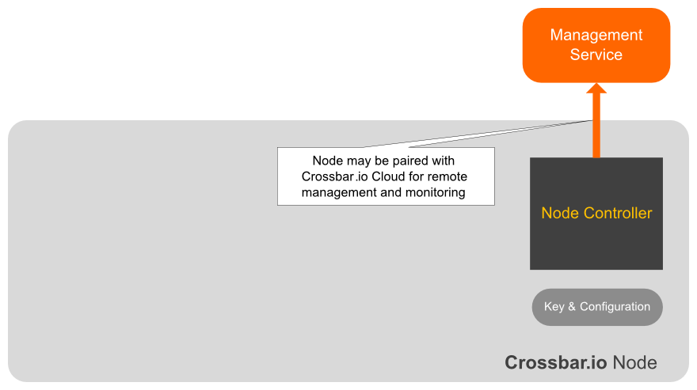
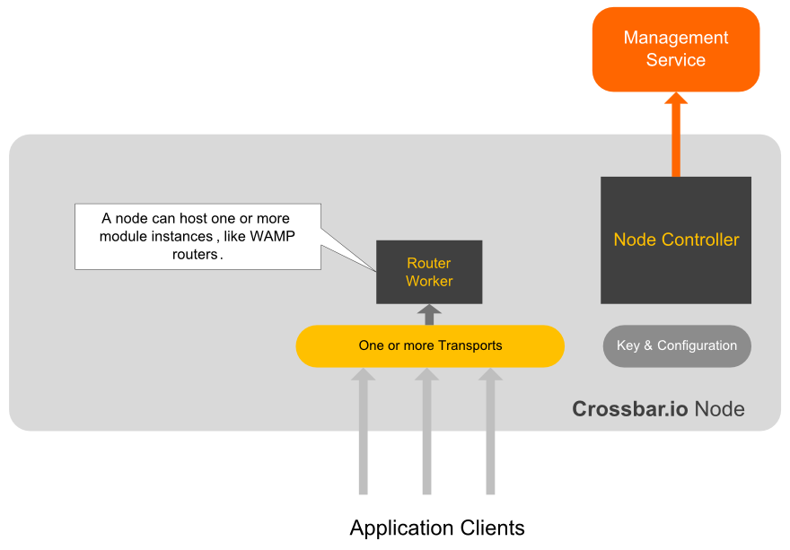
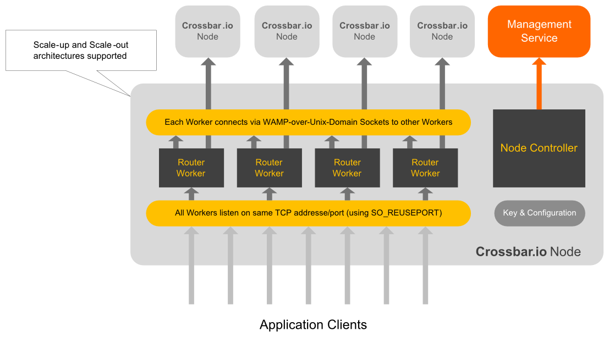
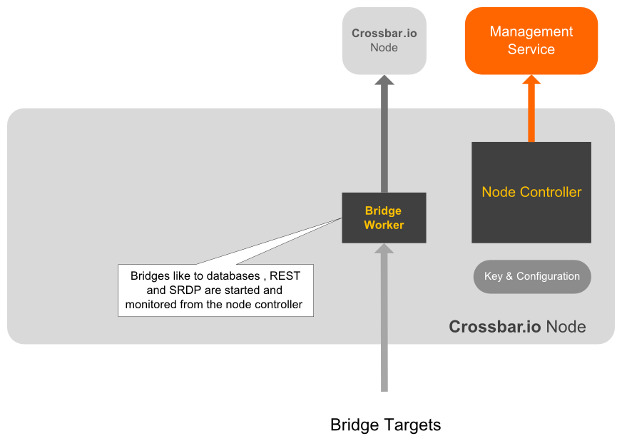
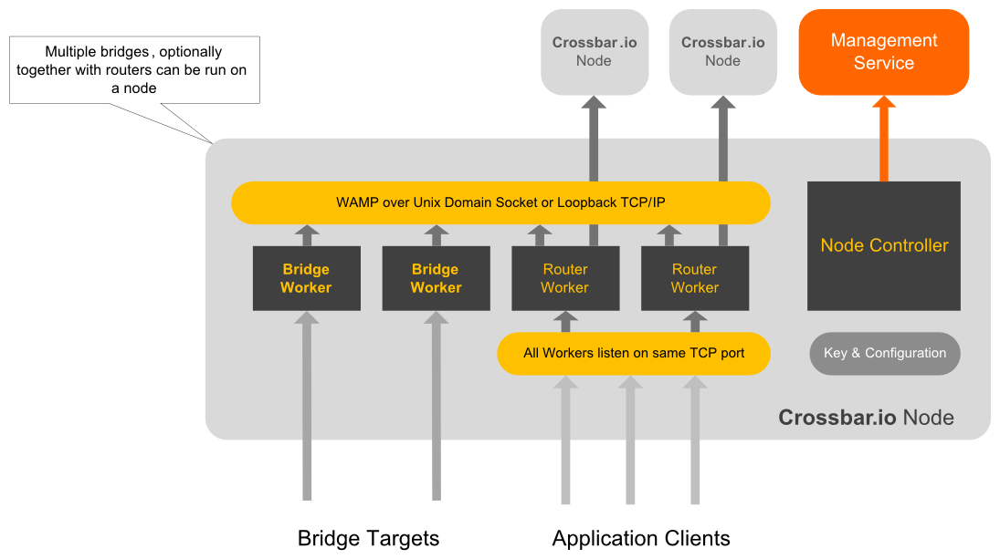
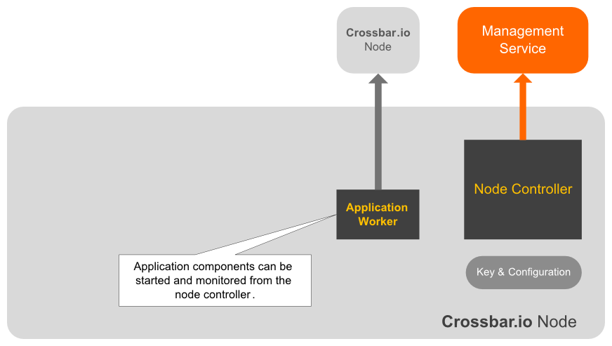
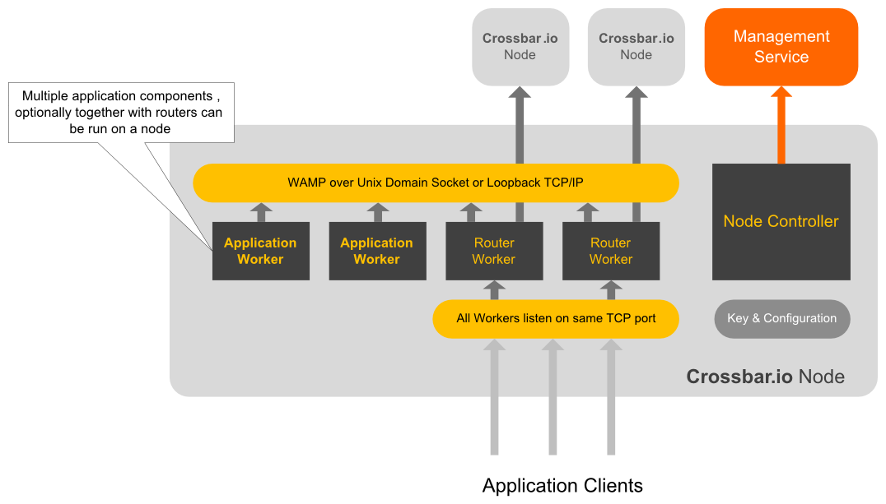

# Getting Started

To initialize a new Crossbar.io instance, create a *data directory* for the instance
 
	crossbar init <data directory>

and startup the instance.

    crossbar start <data directory>

The new Crossbar.io instance will automatically connect to the Crossbar.io Management Cloud and print an *activation code*


    ...
    Instance key generated.
    Instance started.
    ...
    Connected to Crossbar.io Management Cloud.
    Log into https://console.crossbar.io to configure your instance using
    the activation code: 981240

Now open and log into the management interface at
  
	https://console.crossbar.io

and select "Pair Instance", and enter the activation code.

The instance will log it's pairing

    Instance paired. Owner is 'user1'.
    Configured as router.
    Starting instance.
    Starting management service.
    Starting routing service.
    Starting WebSocket transport on port 443/TLS.

# Running Modules

When a Crossbar.io node is initially started, no modules run

<center style="width: 580px; margin: auto;">

</center>

## Running a WAMP Router

Crossbar.io allows to start worker processes on nodes and run modules inside worker processes.

For example, here is the configuration for a Crossbar.io node with one running worker process that acts as a WAMP router over a WebSocket transport:

```javascript
{
   'processes': [
      {
         'type': 'router',
         'realms': {
            'myrealm1': {
               'auth': {
                  'create': {
                     'allow': 'any'
                  },
                  'join': {
                     'allow': 'any'
                  }
               }
               'permissions': {
                  ## application
                  'com.myapp1': {
                     ## application.role
                     'developer': {
                        ## application.role.resource
                        'com.myapp1.monitor.*': {
                           ## application.role.resource.permission
                           'publish': True,
                           'subscribe': True,
                           'call': True,
                           'register': False
                        },
                        'com.myapp1.custom.*': {
                           'publish': True,
                           'subscribe': True,
                           'call': True,
                           'register': 'single'
                        }
                     }
                  }
               },
            }
         },
         'transports': [
            {
               'type': 'websocket',
               'endpoint': 'tcp:localhost:8080'
            },
            {
               'type': 'websocket',
               'endpoint': 'unix:/tmp/sock3'
            }
         ]
      }
   ]
}
```


<center style="width: 580px; margin: auto;">

</center>


## Multi-core and Multi-node

The WAMP router module of Crossbar.io allows to leverage multiple core by starting multiple worker processes for the routing core:

<center style="width: 680px; margin: auto;">

</center>

## Hosting Bridge modules

A node may also host a WAMP bridge:

<center style="width: 580px; margin: auto;">

</center>

## Router with Bridge modules

A node can combine router and bridge modules:

<center style="width: 680px; margin: auto;">

</center>

## Hosting Application components
A node can host application components:

<center style="width: 580px; margin: auto;">

</center>

## Router with Application components
A node can combine router and application modules:

<center style="width: 680px; margin: auto;">

</center>

# Configuration

## Transports

A WebSocket transport listening on TCP port 8080 is configured 

	{
		"type": "websocket",
		"endpoint": "tcp:8080",
        "url": "ws://localhost:8080"
	}

WebSocket options can be set like this

	{
		"type": "websocket",
		"endpoint": "tcp:8080",
        "url": "ws://localhost:8080",
		"options": {
			"opening_timeout": 2000,
			"enable_compression": true
        }
	}

A WebSocket transport listening on a Unix domain socket is configured

	{
		"type": "websocket",
		"endpoint": "unix:/tmp/sock3",
        "url": "ws://localhost:8080"
	}

## Links


*Realms* is a top level attribute of a *Router* module:

	{
	   "processes": [
	      {
	         "type": "router",
	         "realms": {}
          }
       ]
	}

which is a dictionary of named entries

	"realms": {
		"myrealm01": {
		},
		"myrealm02": {
		}
	}

Each entry must contain authentication

	"auth": {
		"create": {
			 "allow": "any"
		},
		"join": {
			 "allow": "any"
		}
	}

and permissions

	"permissions": {
		"com.myapp1": {
			"developer": {
				"com.myapp1.monitor.*": {
				   "publish": True,
				   "subscribe": True,
				   "call": True,
				   "register": False
				}
			}
		}
   	},


# Instance Types

1. **Router**
2. Bridges
   * **PostgreSQL Bridge**
   * Oracle Bridge
   * REST Bridge
   * SRDP Bridge

# Misc

    session, realm, action = 'create' | 'join' => application, role | None
    application, role => list of permissions
    permission: (topic pattern, [pub|sub|list]*) |
                (procedure pattern, [call|register|list]* 


 * http://permalink.gmane.org/gmane.comp.python.twisted/26395
 * http://freeprogrammersblog.vhex.net/post/linux-39-introduced-new-way-of-writing-socket-servers/2
 * https://lwn.net/Articles/542629/
 * http://stackoverflow.com/questions/10077745/twistedweb-on-multicore-multiprocessor
 * http://stackoverflow.com/questions/14388706/socket-options-so-reuseaddr-and-so-reuseport-how-do-they-differ-do-they-mean-t
 * http://stackoverflow.com/questions/12542700/setsockopt-before-connect-for-reactor-connecttcp

