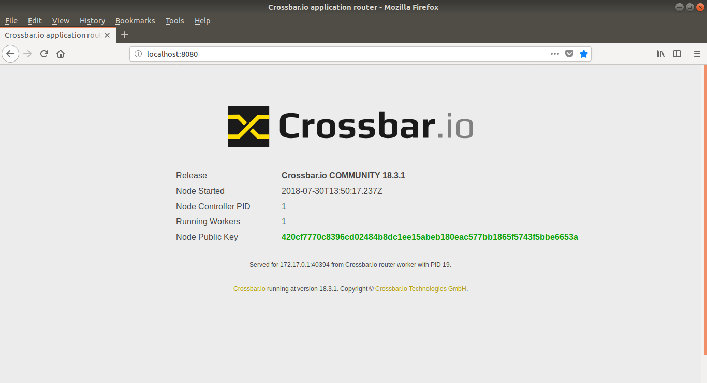

:orphan:

.. To generate html using sphnix-build
   virtualenv -p python3 testenvpy
   source testenvpy/bin/activate
   pip install sphinxcontrib-contentui
   pip install crossbar
   make html

.. _getting-started:

Getting started with Crossbar.io
################################

**Crossbar.io** is an open source networking platform for distributed and microservice applications. It is a feature rich, scalable, robust and secure
implementation of  the open `Web Application Messaging Protocol (WAMP) <https://wamp-proto.org/>`_.

What is WAMP?
=============
WAMP is a routed protocol, with all components connecting to a **WAMP Router**, where the WAMP Router performs message routing between the **WAMP client**.  WAMP provides two messaging patterns:

  * Publish & Subscribe
  * Routed Remote Procedure Calls

WAMP is a `WebSocket <https://en.wikipedia.org/wiki/WebSocket/>`_ sub-protocol, which means that you can communicate with browser using it. In addition to that it can also run over any transport which is **message-oriented, ordered, reliable, and bi-directional** such as TCP, Unix domain socket, etc.

Introduction
============
Crossbar.io is a WAMP router with advanced features implemented in the Python language. It is agnostic to the implementation of the client or its deployment. The below overview shows WAMP clients in different languages communicating with each other.

.. image:: assets/carousel_polyglot.svg
    :align: center
    :alt: alternate text

WAMP Clients
============

The team behind Crossbar.io also maintains a set of WAMP clients as part of the  `Autobahn project <https://crossbar.io/autobahn/>`_.

* `Autobahn|Python <https://github.com/crossbario/autobahn-python/>`_
* `Autobahn|JS <https://github.com/crossbario/autobahn-js/>`_
* `Autobahn|Cpp <https://github.com/crossbario/autobahn-cpp/>`_
* `Autobahn|Java <https://github.com/crossbario/autobahn-java/>`_

Apart from that there are also numerous third-party implementations of `WAMP clients in different languages <https://wamp-proto.org/implementations/index.html/>`_.

The Autobahn project is maintained by the same company Crossbar.io where Crossbar is developed. Apart from that there are also numerous third-party implementations of `WAMP clients in different languages <https://wamp-proto.org/implementations/index.html/>`_.

.. note:: A qualified WAMP client with basic profile should be able to do the following things

 * **Subscribe** to a topic (eg: my.com.hello)

 * **Publish** to a topic

 * **Register** a procedure (eg: my.com.date)

 * **Call** a procedure

Prerequisite
============
For following this guide some (very) basic knowledge of **Python, Javascript, Linux and Docker** commands is useful.

What's in this guide
====================
This guide will show you how to start the Crossbar.io router and some basic application components using Docker containers. We will cover communication between both Python and JavaScript components to show you the basics of how Crossbar.io is used.
Although **Docker is not necessary to run Crossbar.io**, or to develop WAMP applications, it is the quickest way to get the necessary components for developing WAMP applications using Crossbar.io up and running.

Installing Docker
=================
Firstly Docker needs to be installed on your machine. The official Docker site provides instructions on how to get Docker running in your respective operating system at https://docs.docker.com/install/.

.. note:: All the examples here have been tested on Ubuntu 18.04 LTS using Docker, with commands for \*nix shell, but work on other platforms with adaptation.

For other methods of installation refer to the
:doc:`Installation Guide <installation>`.

Example Code
============
The example code that we are going to use here is available at `Crossbar Examples <https://github.com/crossbario/crossbar-examples>`_. There are plenty of examples there in the repository; we are going to use the getting-started.

Fetch the source code using git: ::

  git clone https://github.com/crossbario/crossbar-examples
  cd crossbar-examples/getting-started

All the python examples are available as part of https://hub.docker.com/r/crossbario/autobahn-python/ so we can start straightway the application from Docker.

Starting a Crossbar.io Router
=============================
The Crossbar.io instance can be started with Docker using the below command::

  docker run --rm --name=crossbar -it -p 8080:8080 crossbario/crossbar

.. note:: The ``-p 8080:8080`` argument exposes and maps the port inside the container to the local machine.

If all is good, you should see the output similar to the below:

.. literalinclude:: code/output.txt

Viewing Crossbar Status in a Browser
------------------------------------
Open your favorite browser and navigate to the address http://localhost:8080/info. This should give the below output.

If the Crossbar.io runs as expected - Congratulations! The first step towards building your next IOT application is done successfully.

Realm
=====
Before jumping in to our "Hello World" application, Lets get to understand some basics about Crossbar.io and its configuration.
To run a "Hello World" application we need to specify some basic information in the Crossbar configuration file. They are URL (IP address and port number ) and a realm. A Realm is equivalent to a namespace. a WAMP router needs to provide at least one realm for applications to communicate through. A single Crossbar.io instance can serve more than one realm.

.. note:: Every WAMP session between Crossbar.io and a Client is always attached to a specific Realm. It is not possible for a client connected in a particular realm to see clients of other realm.

Crossbar configuration
======================
The Crossbar configuration file is defined using a JSON or a YAML formatted file. The configuration by default will be loaded from CBDIR/**config.json**  or CBDIR/**config.yaml**. We will be covering in detail about the configuration in the advanced topics. As of now we will see the basic usage here. Now lets have a look at the config.json of the Docker image that we are running. We will copy the files to a local folder as shown below.  ::

  docker cp crossbar:/node/.crossbar/config.json .

``config.json``:

  .. literalinclude:: code/config.json
     :language: json
     :emphasize-lines: 9,39

In the configuration you can see the line **"name": "realm1"** which configures the realm to be "realm1". An the port number is configured as 8080     **"port": 8080**. When connecting to this Crossbar router instance we need to use this particular realm and port number.

.. note:: The config file used in the example is also available
  `here <https://github.com/crossbario/crossbar/blob/master/crossbar/node/templates/default/.crossbar/config.json>`_.

Hello World
===========
Our Hello World application consist of three components:

* Crossbar.io Router
* Autobahn Python Publishing Client
* Autobahn Python Subscriber Client

.. image:: assets/helloworld.svg
    :align: center
    :alt: alternate text

In this example we will be using the Crossbar.io running in the Docker instance. Both the Publisher and Subscriber client will connect to Crossbar.io using the realm and the port number as mentioned in the configuration file. Once connected the Publisher client will publish the string "Hello world" along with a count to the topic **"my.com.hello"**. The Subscriber client will listen to the topic "my.com.hello" and exits after receiving 5 events.

Publishing Client
-----------------

The Docker image is started with ``client_component_publish.py`` as its application along with the URL and Realm passed as environment variable. Here in the URL the IP address points to the linked container name. ::

  docker run -e CBURL="ws://crossbar:8080/ws" -e CBREALM="realm1" --link=crossbar --rm -it crossbario/autobahn-python:cpy3 python client_component_publish.py

Use the same realm value as in the crossbar router. Supplying a wrong realm will disconnect the client.

``1.hello-world/client_component_publish.py``:

    .. literalinclude:: code/client_component_publish.py
     :emphasize-lines: 20

The Autobahn Python project supports two APIs: Appsession (inheritance based) and Component. All the examples displayed here are based on the Component API. In the *crossbar-examples/getting-started* repository, examples of both the type (Appsession and Component) are available, it can be identified with filename containing **component** or **appsession** in it. Apart from that the Autobahn Python support two asynchronous frameworks **twisted** and **asyncio**. The current example is twisted based.

``client_component_publish.py`` publishes using the below API: ::

  session.publish(u'com.myapp.hello', 'Hello World {}'.format(counter))

.. note:: The WAMP supports following data types in serialization **integer, string, bool, list, dict**.
  Please see the `specification <https://wamp-proto.org/static/rfc/draft-oberstet-hybi-crossbar-wamp.html#serializations/>`_
  for more details.

Subscriber Client
-----------------
The subscriber client takes the parameter the same way as publisher client. The application will connect and keep receiving events until you stop it. ::

  docker run -e CBURL="ws://crossbar:8080/ws" -e CBREALM="realm1" --link=crossbar --rm -it crossbario/autobahn-python:cpy3 python client_component_subscribe.py

``1.hello-world/client_component_subscribe.py``:

  .. literalinclude:: code/client_component_subscribe.py
     :language: python
     :emphasize-lines: 19

The subscriber client subsribes to the topic "com.myapp.hello". Each time an event arrives the ``oncounter`` method is called.

Autobahn from Browser
=====================

Now that we have tried a pure Python communication, its time to gets internetized and try the next example using Browser with **Autobahn Javascript** example. For that firstly we need to ensure that the browser is capable of Websocket connection. This can be tested using the https://caniuse.com/#search=websocket. The example that we are going to see is the same as the previous example with only difference that this one uses Autobahn Javascript instead of Autobahn Python.

.. image:: assets/helloworld-browser.svg
    :align: center
    :alt: alternate text

The Javascript example code is available in the ``crossbar-examples/getting-started/2.pubsub-js/`` folder.

.. note:: The Javascript examples can be run directly from browser by clicking .html file.

Backend/Publisher
-----------------
To start the application, just open the ``backend.html`` file using the browser. It will automatically load the scripts and then get started.
Then it will start publishing events the same way as the Python client did.

``2.pubsub-js/backend.html``:

  .. literalinclude:: code/backend.html
     :language: html

As you can see in the source, inclusion of ``autobahn.min.js`` loads the Autobahn Javascript file to the browser, and the next line loads the ``backend.js`` which contains our publishing application.

``2.pubsub-js/backend.js``:

  .. literalinclude:: code/backend.js
     :language: javascript
     :emphasize-lines: 19

The connection is made to the localhost at port 8080 with realm ``realm1`` . The below line does the publishing: ::

  session.publish('com.myapp.hello', ['Hello World ' + counter]);

The output:

.. image:: assets/pubsub-backend-browser.png
    :align: center
    :alt: alternate text

Frontend/Subscriber
-------------------
The frontend uses the same autobahn.min.js that is used by the backend.

``2.pubsub-js/frontend.html``:

  .. literalinclude:: code/frontend.html
     :language: html

``2.pubsub-js/frontend.js``:

  .. literalinclude:: code/frontend.js
     :language: javascript
     :emphasize-lines: 28

The below line subscribes to the topic ``com.myapp.hello`` and each time an event arrives the function ``onevent1`` is called: ::

  session.subscribe('com.myapp.hello', onevent1);

The output

.. image:: assets/pubsub-frontend-browser.png
    :align: center
    :alt: alternate text

Mixing it together
------------------
Lets experience the power of WAMP's language agnosticism by publishing/subscribing to a topic both from Python and
Javascript simultaneously.

.. image:: assets/pubsubmix.svg
    :align: center
    :alt: alternate text

Please try the above example on your own.

Moving on we will cover the next important feature of the Crossbar - Remote Procedude Calls.

RPC Example
===========
Here a WAMP client will register a subroutine (i.e. a function) to a particular topic - to be called by some other client; hence it is called **Callee**. The **Caller** client can use the topic and call the remote procedure.

The Callee client will implement the date procedure and register it to the topic ``com.myapp.date``, the Caller can call the date function to know the date of that particular client.

.. image:: assets/helloworldrpc.svg
    :align: center
    :alt: alternate text

Callee
------
Lets start Callee first: ::

  docker run -e CBURL="ws://crossbar:8080/ws" -e CBREALM="realm1" --link=crossbar --rm -it crossbario/autobahn-python:cpy3 python client_component_rpc_callee.py

``3.rpc/client_component_rpc_callee.py``:

.. literalinclude:: code/client_component_rpc_callee.py
   :language: python
   :emphasize-lines: 24

The time service is registered with ``utcnow`` as the function
When the caller calls, the result of ``utcnow`` is sent back.  ::

  yield session.register(utcnow, u'com.myapp.date')

Caller
------
Now lets start Caller: ::

  docker run -e CBURL="ws://crossbar:8080/ws" -e CBREALM="realm1" --link=crossbar --rm -it crossbario/autobahn-python:cpy3 python client_component_rpc_caller.py

``3.rpc/client_component_rpc_caller.py``:

.. literalinclude:: code/client_component_rpc_caller.py
   :language: python
   :emphasize-lines: 20

Leaving the boiler place code, we can see that the application calls the remote function using the topic.  ::

  res = yield session.call(u'com.myapp.date')

And the output is: ::

  2018-08-31T05:40:20+0000 call result: 2018-08-31T05:40:20Z

.. note:: It is not possible to register the same RPC twice, unless you explicitly allow
  `Shared Registrations <https://crossbar.io/docs/Shared-Registrations/>`_.

So far we covered the pubsub example using python and javascript and RPC using python. You can also try to run RPC using Javascript.
For other examples refer to `Crossbar Examples <https://github.com/crossbario/crossbar-examples>`_.

Modifying Things
================
The containers as-is are there to demonstrate the principles. To develop your own applications, you need to modify the code they run as well as the Crossbar.io config file. The application components are in the /app directory of `Autobahn Python Docker x86_64 <https://github.com/crossbario/autobahn-python/tree/master/docker/x86_64/app>`_ , `armhf  <https://github.com/crossbario/autobahn-python/tree/master/docker/armhf/app>`_, `aarch64  <https://github.com/crossbario/autobahn-python/tree/master/docker/aarch64/app>`_ . The Crossbar.io `configuration file is in the .crossbar subdirectory <https://github.com/crossbario/crossbar/blob/master/crossbar/node/templates/default/.crossbar/config.json>`_.

Further Materials
=================
* Installation of Crossbar.io
* Basic concept of WAMP and Crossbar.io
* Creating Docker Images
* Overview of WAMP Client libraries
