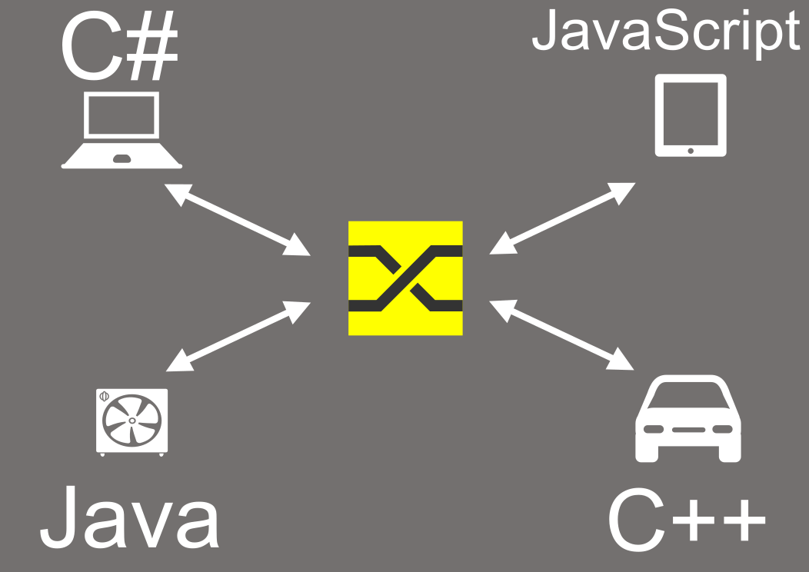
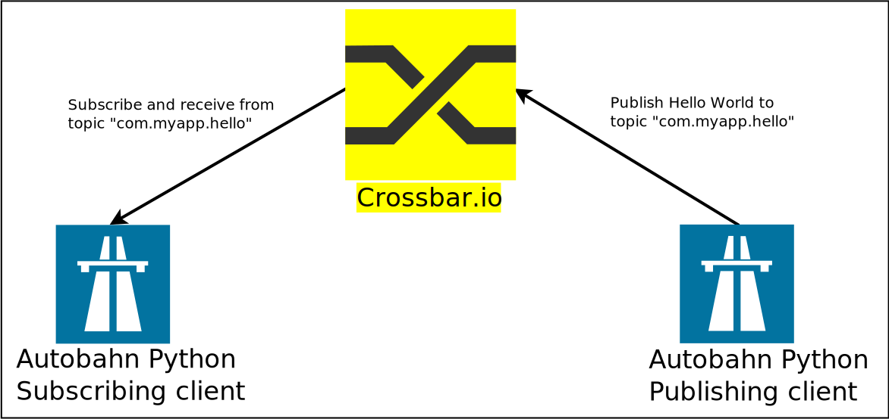
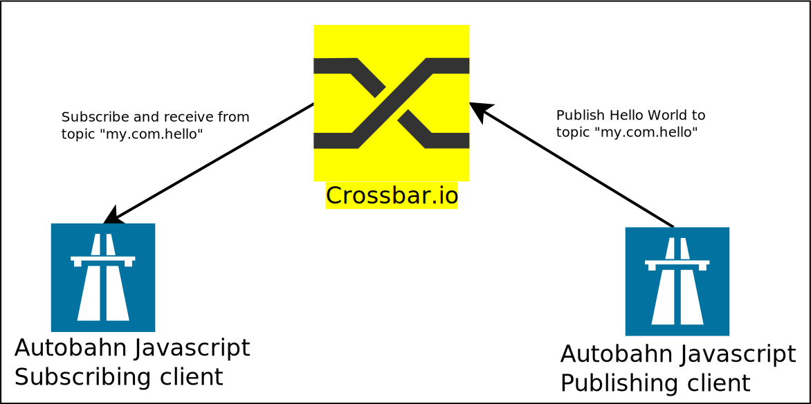
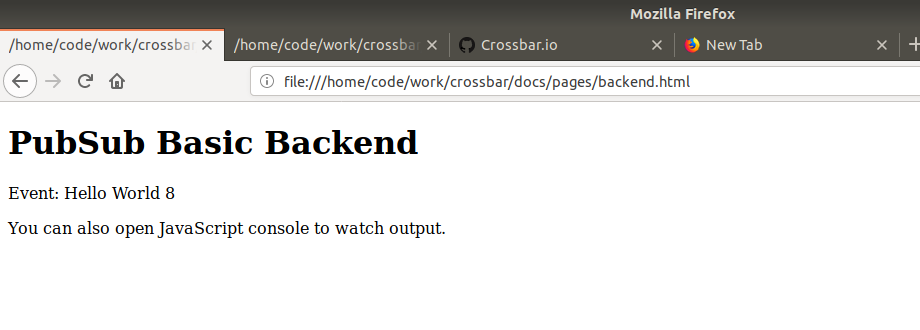
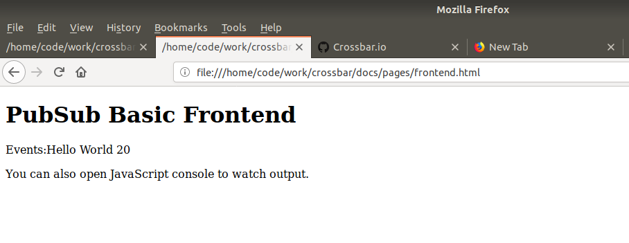
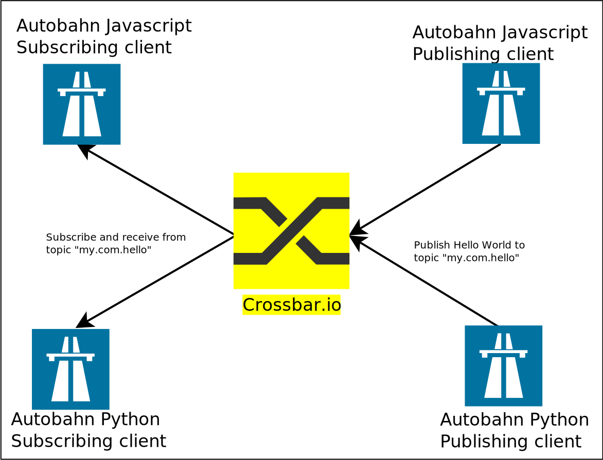
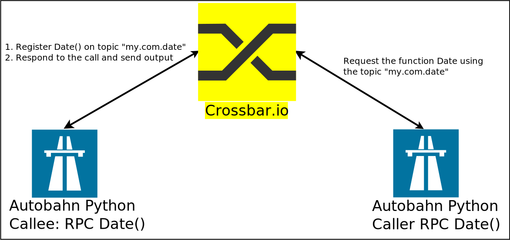

:orphan:

.. To generate html using sphnix-build
   virtualenv -p python3 testenvpy
   source testenvpy/bin/activate
   pip install sphinxcontrib-contentui
   pip install crossbar
   make html

.. _getting-started:

Getting started with Crossbar.io
=================================

**Crossbar.io** is an open source networking platform for distributed and microservice applications. It is a feature rich, scalable, robust and secure
implementation of  the open `Web Application Messaging Protocol (WAMP) <https://wamp-proto.org/>`_.

What is WAMP?
=============
WAMP is a routed protocol, with all components connecting to a **WAMP Router**, where the WAMP Router performs message routing between the **WAMP client**.  WAMP provides two messaging patterns:

  * Publish & Subscribe
  * Routed Remote Procedure Calls.

WAMP is a `WebSocket <https://en.wikipedia.org/wiki/WebSocket/>`_ sub-protocol, which means that you can communicate with browser using it. In addition to that it can also run over any transport which is **message-oriented, ordered, reliable, and bi-directional** such as TCP, Unix domain socket etc.

Introduction:
=============
Crossbar.io is a WAMP router with advanced features implemented in the Python language. It is agnostic to the implementation of the client or its deployment. The below overview shows WAMP clients in different languages communicating with each other.

WAMP Clients
============

The team behind Crossbar.io also maintains a set of WAMP clients as part of the  `Autobahn project <https://crossbar.io/autobahn/>`_.

* `Autobahn|Python <https://github.com/crossbario/autobahn-python/>`_
* `Autobahn|JS <https://github.com/crossbario/autobahn-js/>`_
* `Autobahn|Cpp <https://github.com/crossbario/autobahn-cpp/>`_
* `Autobahn|Java <https://github.com/crossbario/autobahn-java/>`_

Apart from that there are also numerous third-party implementations of `WAMP clients in different languages <https://wamp-proto.org/implementations/index.html/>`_.

.. note:: A qualified WAMP client with basic profile should be able to do the following things

 * **Subscribe** to a topic (eg: my.com.hello)

 * **Publish** to a topic

 * **Register** a procedure (eg: my.com.date)

 * **Call** a procedure

Prerequisite:
=============
For following this guide some (very) basic knowledge of **Python, Javascript, Linux and Docker** commands is useful.

What's in this:
===============
This guide will show you how to start the Crossbar.io router and some basic application components using Docker containers. We will cover communication between both Python and JavaScript components to show you the basics of how Crossbar.io is used.

Although **Docker is not necessary to run Crossbar.io**, or to develop WAMP applications, it is the quickest way to get the necessary components for developing WAMP applications using Crossbar.io up and running.

For other methods of installation refer to -
:doc:`Installation Guide <installation>`

Installing Docker
=================
Firstly Docker needs to be installed on your machine. The official Docker site  provides instruction on how to get Docker running in your respective operating system https://docs.docker.com/install/ .

.. note:: All the examples here have been tested on  Ubuntu 18.04 LTS using Docker, and the following is for *nix shell, but works on other platforms with adaptation

Example Code
============
The example code that we are going to use here is available at https://github.com/crossbario/crossbar-examples. There are plenty of examples there in the repository, we are going to use the getting-started one.

Fetch the source code using git
::

  git clone https://github.com/crossbario/crossbar-examples
  cd crossbar-examples/getting-started

All the python examples are available as part of https://hub.docker.com/r/crossbario/autobahn-python/ so we can start the application from Docker straighatway.

Starting a Crossbar.io Router:
==============================
To pull the latest Crossbar.io (Community) image from DockerHub:
::

  sudo docker pull crossbario/crossbar

The Crossbar.io instance can be started with Docker using the below command
::

  sudo docker run -it -p 8080:8080 crossbario/crossbar

.. note:: The line **8080:8080** exposes and maps the port number of the Docker instance to the local machine.

Crossbar Console Output:
------------------------
The above command when successful will throw an output as shown below.

.. literalinclude:: code/output.txt

Crossbar Browser Output:
------------------------
Open your favorite browser and navigate to the address http://localhost:8080/info. This should give the below output.

    .. image:: assets/crossbar-works.png
        :align: center
        :alt: alternate text

If the Crossbar.io runs as expected then congratulations for the first step of success towards building your next IOT application.

Realm :
=======
Before jumping in to our "Hello World" application, lets try to understand some basics about Crossbar.io and its configuration.

To run a "Hello World" application we need to specify some basic information in the Crossbar configuration file. They are URL (IP address and port number) and  realm.  A Realm is equivalent to namespace. a WAMP router needs to provide atleast one realm for applications to communicate. Crossbar.io has the capability to provide more than one realm.

.. note:: Every WAMP session between Crossbar.io and a Client is always attached to a specific Realm. It is not possible for a client connected in a particular realm to see clients of other realm.

Crossbar configuration:
=======================
The Crossbar configuration file is defined using a JSON or a YAML formatted file. The configuration by default will be loaded from CBDIR/**config.json**  or CBDIR/**config.yaml**. We will be covering in detail about the configuration in the advanced topics. As of now we will see the basic usage here. Now lets have a look at the config.json of the Docker image that we are running. To view that need to find the container id and then copy the files to local folder as shown below.

::

  $docker ps
  CONTAINER ID        IMAGE                 COMMAND                  CREATED             STATUS              PORTS                              NAMES
  7e2deaba1f61        crossbario/crossbar   "crossbar start --cb…"   9 hours ago         Up 9 hours          8000/tcp, 0.0.0.0:8080->8080/tcp   clever_meninsky

  $docker cp  7e2deaba1f61:/node/.crossbar/config.json .

config.json
-----------
    .. literalinclude:: code/config.json
       :language: json
       :emphasize-lines: 9,39

In the configuration you can see the line **"name": "realm1"** which configures the realm to be "realm1". An the port number is configured as 8080     **"port": 8080**. When connecting to this Crossbar router instance we need to use this particular realm and port number.

.. note:: The config file used in the example is also available here https://github.com/crossbario/crossbar/blob/master/crossbar/node/templates/default/.crossbar/config.json

Hello World
===========
Our Hello World application consist of three components,

* Crossbar.io Router
* Autobahn Python Publishing Client
* Autobahn Python Subscriber Client

In this example we will be using the Crossbar.io running in the Docker instance. Both the Publisher and Subscriber client will connect to Crossbar.io using the realm and the port number as mentioned in the configuration file. Once connected the Publisher client will publish the string "Hello world" along with a count to the topic **"my.com.hello"**. The Subscriber client will listen to the topic "my.com.hello" and exits after receiving 5 events.

Publishing Client:
------------------

The Docker image is started with client_component_publisher.py as its application along with it the URL and Realm  are passed as environment variable.Here in the URL the IP address points to the IP of the host machine, since we have mapped the port number 8080 of the  localmachine to the Docker instance it will connect to the Crossbar.io instance running inside Docker. ::

   $ docker run -e CBURL="ws://192.168.0.15:8080/ws"  -e CBREALM="realm1" -it  crossbario/autobahn-python:cpy3   python client_component_publisher.py

The Realm that is available in crossbar router is used here. Supplying a wrong realm will disconnect the client.

1.hello-world/client_component_publish.py
------------------------------------------
    .. literalinclude:: code/client_component_publish.py

The Autobahn Python project supports two APIs namely Appsession (inheritance based) and Component. All the examples explained here are based on Component.In the *crossbar-examples/getting-started* repository, examples of both the type (Appsession and Component) are available, it can be identified with filename containing **component** or **appsession** in it. Apart from that the Autobahn Python support two asynchronous frameworks **twisted** and **asyncio**. In this example we are seeing twisted based example.

The  client_component_publish.py publishes using this api as shown below. ::

 session.publish(u'com.myapp.hello', "Hello World %d"%counter)

.. note:: The WAMP supports following data types in serialization **integer, string, bool, list, dict** https://wamp-proto.org/static/rfc/draft-oberstet-hybi-crossbar-wamp.html#serializations/

Subscriber Client:
------------------
The subscriber client takes the parameter the same way as publisher client. The application will connect and **receive 5 events** and then exit. ::

  docker run -e CBURL="ws://192.168.0.15:8080/ws"  -e CBREALM="realm1" -it  crossbario/autobahn-python:cpy3    python client_component_subscribe.py

1.hello-world/client_component_subscribe.py
-------------------------------------------
.. literalinclude:: code/client_component_subscribe.py
   :language: python
   :emphasize-lines: 22

The subscriber client subsriber to the topic "com.myapp.hello" and each time a event arrives the on_event method is called.
::

  yield session.subscribe(oncounter, u'my.com.hello')

Autobahn from Browser:
======================

Now that we have tried a pure python communication, its time to gets internetized and try the next example using Browser with **Autobahn Javascript** example. For that firstly we need to ensure that the browser is capable of Websocket connection. This can be tested using the https://caniuse.com/#search=websocket . The example that we are going to see is the same as the previous example with only difference is that this one uses Autobahn Javascript instead of Autobahn Python.

The Javascript example code is available in the following folder
::

  cd crossbar-examples/getting-started/2.pubsub-js/

.. note:: The Javascript examples can be run directly from browser by clicking .html file

Backend/Publisher:
------------------
To start the application, just open the **"backend.html"** file using the browser. It will automatically load the scripts and then get started.
Then it will start publishing the event the same way as the python client did.

2.pubsub-js/backend.html
------------------------
.. literalinclude:: code/backend.html
   :language: html

If you see source code, the include of **autobahn.min.js** loads the Autobahn Javascript file to the browser, and the next line loads the **backend.js** which contains our publishing application.

2.pubsub-js/backend.js
----------------------
.. literalinclude:: code/backend.js
   :language: javascript
   :emphasize-lines: 19

The connection is made to the localhost at port 8080 with realm **realm1** . The below line does the publishing

::

    session.publish('com.myapp.hello', ['Hello World '+counter]);

Output:
-------

Frontend/Subscriber:
--------------------
The frontend uses the same autobahn.min.js that is used by the backend.

2.pubsub-js/frontend.html
-------------------------
.. literalinclude:: code/frontend.html
   :language: html

2.pubsub-js/frontend.js
-----------------------
.. literalinclude:: code/frontend.js
   :language: javascript
   :emphasize-lines: 28

The below line subscribes to the topic **com.myapp.hello** and each time an event arrives the function *onevent1* is called.
::

  session.subscribe('com.myapp.hello', onevent1);

Output:
-------

.. note:: You can run the python and javascript publishing and subscribing to the same topic and the sametime.

You can try the example on your own as described.

Moving on we will cover the next important feature of the Crossbar i.e  Remote Procedude Calls. Here a WAMP client will register a subroutine or a function to a particular topic, to be called by some other client hence it is called **Callee**. The **Caller** client can use the topic and call the remote procedure.

RPC Example
===========
The Callee client will implement the date procedure and register it to the topic **"my.com.date"**, the Caller can call the date function to know the date of that particular client.

RPC Caller Client:
::

  docker run -e CBURL="ws://192.168.0.15:8080/ws"  -e CBREALM="realm1" -it  crossbario/autobahn-python:cpy3   python client_component_rpc_caller.py

3.rpc/client_component_rpc_caller.py
------------------------------------
.. literalinclude:: code/client_component_rpc_caller.py
   :language: python
   :emphasize-lines: 20

Leaving the boiler place code, we can see that the application calls the remote function using the topic.
::

  res = yield session.call(u'my.com.date')

RPC Callee Client:
::

  docker run -e CBURL="ws://192.168.0.15:8080/ws"  -e CBREALM="realm1"  -it  crossbario/autobahn-python:cpy3   python client_component_rpc_callee.py

3.rpc/client_component_rpc_callee.py
------------------------------------
.. literalinclude:: code/client_component_rpc_callee.py
   :language: python
   :emphasize-lines: 24

The time service is registered with *utcnow* as the function, when the caller calls, the result of utcnow is sent back.
::

  yield session.register(utcnow, u'my.com.date')

Output:
::

  2018-07-31T20:57:23+0000 Current time from time service: 2018-07-31T20:57:23Z

.. note:: It is not possible to register the same topic twice, it needs to be different.

So far we covered the pubsub example using python and javascript and RPC using python. You can also try to run RPC using Javascript.
For other examples refer to https://github.com/crossbario/crossbar-examples

Modifying Things
================
The containers as-is are there to demonstrate principles. To develop your own applications, you need to modify the code they run as well as the Crossbar.io config file. The application components are in the /app directory of `Autobahn Python Docker x86_64 <https://github.com/crossbario/autobahn-python/tree/master/docker/x86_64/app>`_ , `armhf  <https://github.com/crossbario/autobahn-python/tree/master/docker/armhf/app>`_, `aarch64  <https://github.com/crossbario/autobahn-python/tree/master/docker/aarch64/app>`_ . The Crossbar.io `configuration file is in the .crossbar subdirectory <https://github.com/crossbario/crossbar/blob/master/crossbar/node/templates/default/.crossbar/config.json>`_.

Further Materials
=================
* Installation of Crossbar.io
* Basic concept of WAMP and Crossbar.io
* Creating Docker Images
* Overview of WAMP Client libraries
