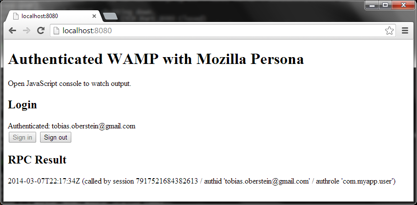

Authentication with Mozilla Persona
===================================

This example shows how to authenticate WAMP connections on **Crossbar**.io using [Mozilla Persona](http://www.mozilla.org/en-US/persona/) and [**Autobahn**|JS](https://github.com/tavendo/AutobahnJS/). The code works with purely static Web pages and WebSocket only.

Start Crossbar.io from this directory

	crossbar start

open **http://localhost:8080** in your browser and login via Persona:



The WAMP connection has been authenticated via Mozilla Persona.

The Crossbar.io configuration also specifies the mapped role for authenticated users:

```javascript
"ws": {
   "type": "websocket",
   "url": "ws://localhost:8080/ws",
   "cookie": {},
   "auth": {
      "mozilla_persona": {
         "role": {
            "type": "static",
            "value": "com.myapp.user"
         }
      }
   }
}
```

Note that caller authentication information can be accessed in procedure endpoints (and event handlers):

```python
def utcnow(details = None):
   ## details is an instance of autobahn.wamp.types.CallDetails
   ## and provides information on the caller
   now = datetime.datetime.utcnow()
   now = now.strftime("%Y-%m-%dT%H:%M:%SZ")
   return "{} (called by session {} / authid '{}' / authrole '{}')".format(\
      now, details.caller, details.authid, details.authrole)

## To get caller information when being called, we need to
## register with options ..
self.register(utcnow, 'com.timeservice.now',
   options = RegisterOptions(details_arg = 'details', discloseCaller = True))
```


References:

* [Crossbar.io Authentication](https://github.com/crossbario/crossbar/wiki/Authentication)
* [Mozilla Persona Developer Site](https://developer.mozilla.org/en-US/Persona)


